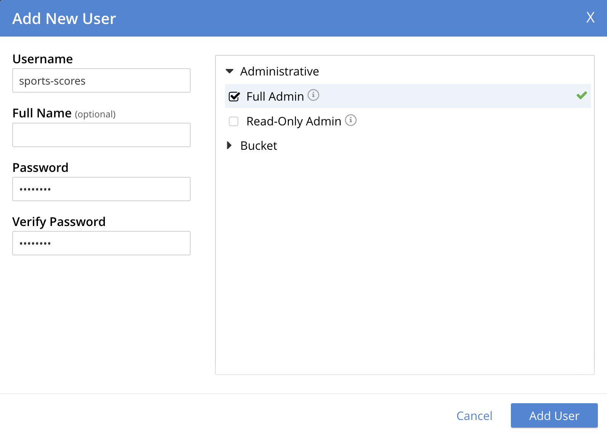

# Getting Started

There's a few things you'll need on your laptop before you can start hacking on sports-graphics:

- Node.js
- Yarn
- Couchbase Server
- Redis
- NodeCG
- Git
- The code itself

In addition, while it's not necessary, we recommend using [Docker](https://www.docker.com/get-started/) to install Couchbase Server, especially if you're on a M1 MacBook.

It sounds like a long list, but you only need to go through it once and you're set! Let's get started.

## Node.js

Go to the [Node](https://nodejs.org/en/) website and download the latest LTS (long term support) version. Alternatively if you're on a Mac and have [Homebrew](http://homebrew.sh/) you can run `brew install node@16`.

## Yarn

Yarn is a package manager for Node, specifically an alternative to the usual npm. There's a few reasons this project uses Yarn (mostly "the original developers prefer it to npm").

Follow the [Yarn installation instructions](https://yarnpkg.com/getting-started/install) to get it.

## Couchbase Server

Couchbase is the database that we use for storing event data. For this example we'll install it using Docker, though you can install it [directly](https://www.couchbase.com/downloads) (except on a M1 MacBook where Docker is the only way currently).

First, create a volume to keep the data around between restarts:

```sh
$ docker volume create cbdata
```

Then launch the container:

```sh
$ docker run -d -v cbdata:/opt/couchbase/var/lib/couchbase --restart=always -p 8091-8096:8091-8096 -p 11207-11211:11207-11211 -p 18091-18096:18091-18096 --name cb couchbase/server:community-7.1.0
```

(if you're on a M1 MacBook substitute the last part for `couchbase/server:community-7.1.0-aarch64`)

Then go to http://localhost:8091 (refresh a few times if you get nothing). Select "Setup New Cluster" and walk through the setup steps until you get to the Configure screen. Change the Data memory quota to 512MB, and leave everything else at the defaults.

Then go to the Buckets tab on the left and click Add Bucket on the top-right. Name it `sports-scores` and leave everything else as the defaults.

Finally, go into the Security tab, and create a user with the username `sports-scores`, password `password`, and Full Admin permissions. It should look like this:



## Redis

Redis is a "micro-database" that some things (namely real-time updates) rely on.

We'll also install Redis using Docker. Run the following command, and you're all set.

```
$ docker run -d --restart=always -p 6379:6379 redis:6-alpine
```

## Git

Git is the system we use to manage our code and combine the work of multiple developers. Get it from the [Git website](https://git-scm.com/downloads).

## NodeCG

NodeCG is the framework that powers the graphics themselves, and our code needs to be placed inside of it. YSTV uses a fork of NodeCG to work around some issues in the upstream version.

Get the NodeCG code:

```shell
$ git clone --branch ystv https://github.com/ystv/nodecg.git
```

Inside the `nodecg` folder it just created, run `npm ci --production` to install NodeCG's dependencies.

While we're here, let's set up some bits we'll need later: in the `cfg` folder create a file called `ystv-sports-graphics.json` with the following contents:

```json
{
  "scoresService": {
    "apiURL": "http://localhost:8000/api"
  }
}
```

Create another file in the `cfg` folder called `nodecg.json` with these contents:

```json
{
  "logging": {
    "console": {
      "enabled": true,
      "timestamps": true,
      "level": "debug"
    }
  }
}
```

## sports-scores code

Go into the `nodecg/bundles` folder and run this command:

```
git clone https://github.com/ystv/ystv-sports-graphics.git
```

Open `ystv-sports-graphics` in your code editor of choice.

# Check it all worked

First, to get all the dependencies our code is built upon, invoke Yarn:

```sh
$ yarn
```

Then, configure it to talk to your Couchbase and Redis. Inside the `scores-src` folder, create a file called `.env.local` and put in the following values:

```
DB_CONNECTION_STRING=couchbase://localhost
DB_USER=sports-scores
DB_PASSWORD=password
DB_BUCKET=sports-scores
REDIS_CONNECTION_STRING=redis://localhost
```

Next, run the code and see if it works!

```sh
# inside the scores-src folder
$ yarn dev
```

Watch the output and look for a line starting with `No existing application data found.`. Copy the long token at the end, and go to http://localhost:3000/bootstrap. Enter that token there, then set up a user (the username and password don't matter). Then you should be able to get to the home screen!

Finally, let's check that we have NodeCG set up. Open a new terminal, switch to the `bundle-src` folder, and run `yarn bundle:build`, then `yarn nodecg`, then go to http://localhost:9090.

You're all set! In the [next part](./01-code-structure.md), we'll go on a quick tour of how the code is laid out.
